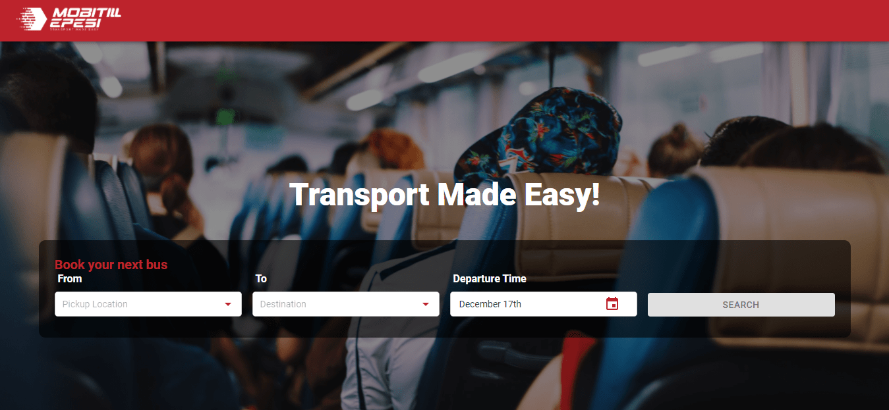
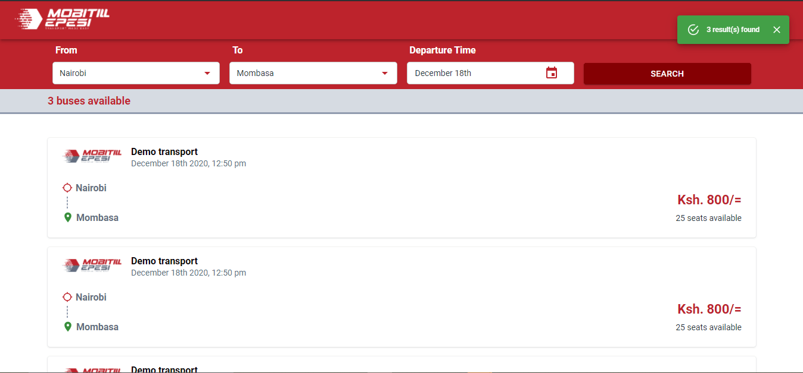
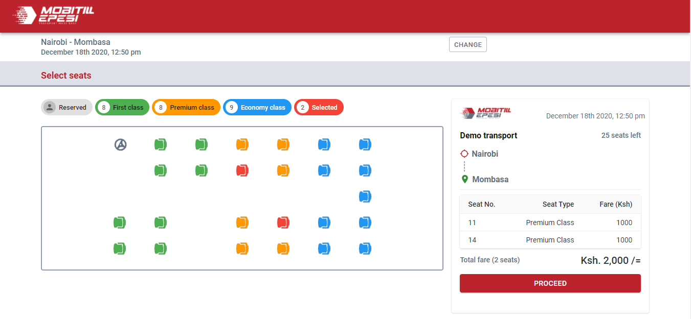
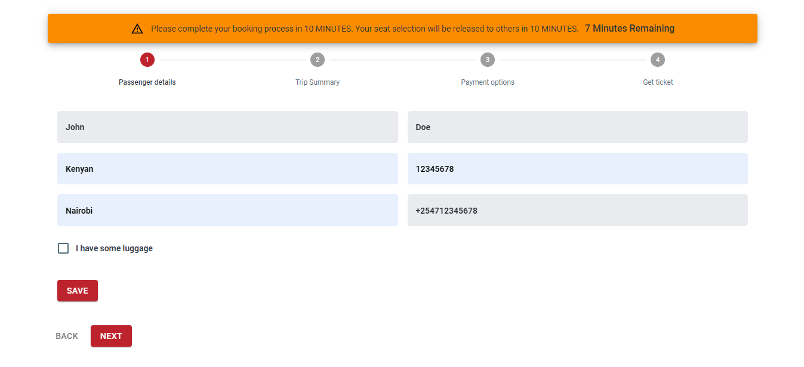
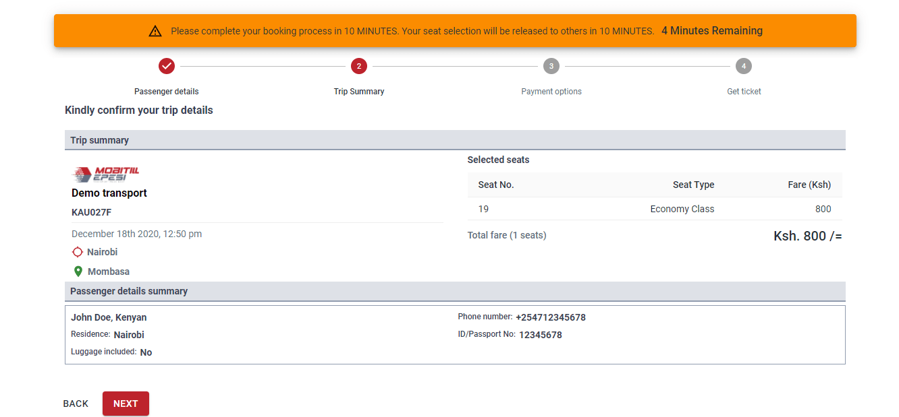
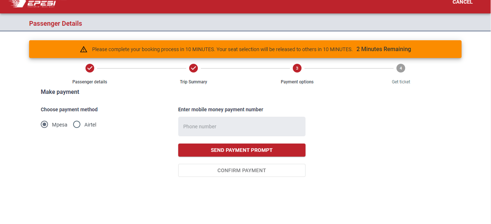

## [User Flow Doc for Mobitill - Booking Portal](https://booking.mobitill.com/) [](https://twitter.com/intent/tweet?text=%F0%9F%9A%A8Devias%20Freebie%20Alert%20-%20An%20awesome%20ready-to-use%20register%20page%20made%20with%20%23material%20%23react%0D%0Ahttps%3A%2F%2Fdevias.io%20%23createreactapp%20%23devias%20%23material%20%23freebie%20%40devias-io)


## Mobitill User Flow Documentation
> This is the User Flow Documentation for the Booking Application.

_________________________________________________________
| Booking Portal              | [booking.mobitill.com](https://booking.mobitill.com/) |
| ------------------------ | ----------------------------------------------------------- |
| **DATE**                 | ✔ **17/12/2020** 
| **AUTHORS**              | ✔ **Laban, Ochieng, Cyril**
| - **VERSION**            | ✔ **1.0**  
| - **DESCRIPTION**        | ✔ **An online bus ticket booking system .**     

________________________________________________________________________________________________________________________


## 1.  Home Page

```
This is the Landing Page of the Booking Portal.
- Select pickup location, Destination and preffered date of travel.
- Click/tap "Search" button to get a list of available buses.
```

[](https://booking.mobitill.com/)

## 2.  Trip Search Result Page

```

Available trips are displayed here.
- Select your preffered bus to proceed to seat selection.

```
[](https://booking.mobitill.com/)

## 3.  Seat Selection Page
```
Available seats for the selected bus are displayed here.
- Choose your preffered seat(s) by tapping/clicking on it.
- Click "Proceed" button to enter passenger details and make payments.

```
[](https://booking.mobitill.com/)

> Please note that you have 10 minutes to complete the remaining process. Your seats will be released to other users after the 10 minutes elapses.


## 4.  Passenger Details Page

```
- Enter passenger details.
- If the passenger has luggage, click on the "I have some luggage" checkbox.
- Enter a brief description of your luggage.
- Click "save" button, then "next" button to proceed to "trip summary".

```

[](https://booking.mobitill.com/)

## 5.  View Trip Summary Page
```
- Confirm your trip details  
- Click/tap "next" to proceed to payments.

```

[](https://booking.mobitill.com/)

## 6.  Payment Options Page

```
- Choose your preffered payment method.
- Enter mobile payment phone number.
- Click/tap "send payment prompt" button to make mobile payment request to your phone.
- Enter your mobile money PIN on your mobile device to authorize payment transaction.
-  After payment is done successfully, click "confirm payment" button to complete your booking and generate ticket.


```

[](https://booking.mobitill.com/)


[](https://booking.mobitill.com/)

