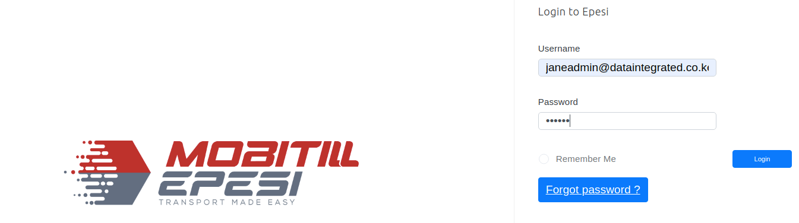
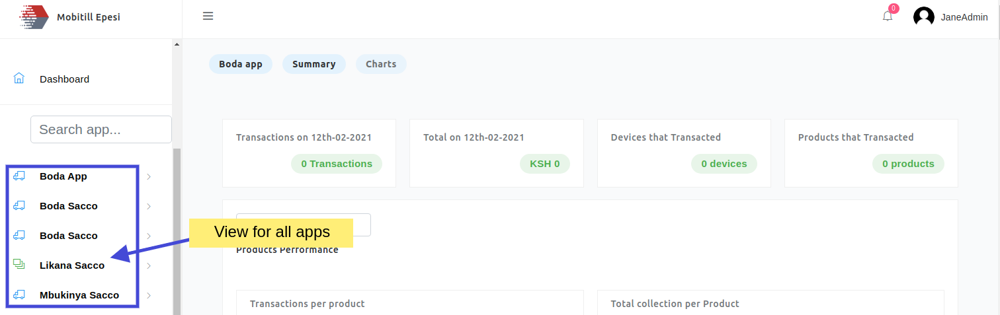
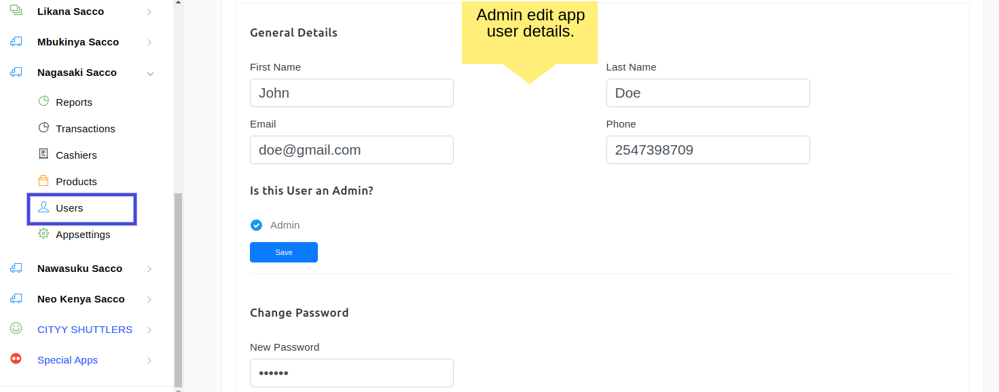
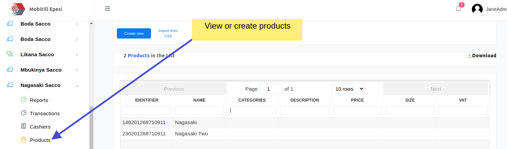
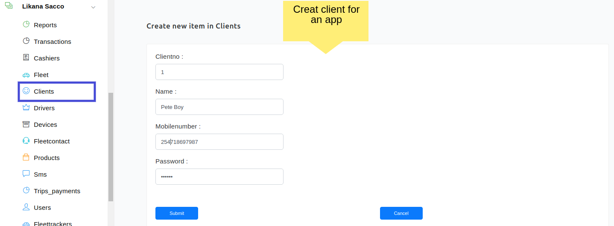
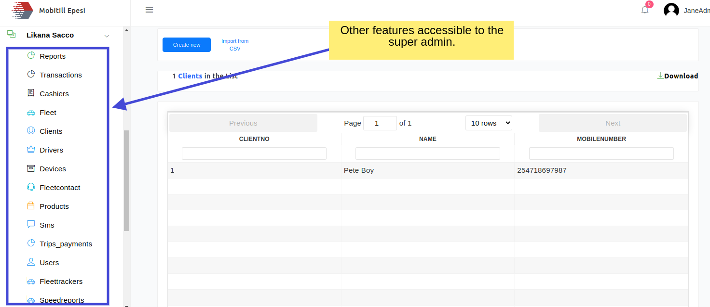
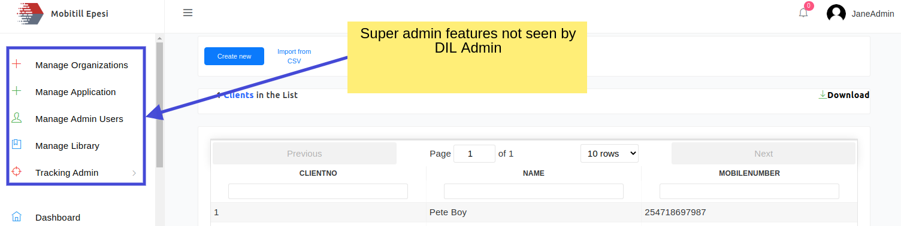

## [EPESI DASHBOARD USER FLOW DOCUMENTATION](https://dashboard.mobitill.com/) [](https://twitter.com/intent/tweet?text=%F0%9F%9A%A8Devias%20Freebie%20Alert%20-%20An%20awesome%20ready-to-use%20register%20page%20made%20with%20%23material%20%23react%0D%0Ahttps%3A%2F%2Fdevias.io%20%23createreactapp%20%23devias%20%23material%20%23freebie%20%40devias-io)


## Epesi Dashboard User Flow Documentation
> This is the User Flow Documentation for the Epesi Dashboard Application.

_________________________________________________________
| Epesi Dashboard              | [https://dashboard.mobitill.com/](https://dashboard.mobitill.com/) |
| ------------------------ | ----------------------------------------------------------- |
| **DATE**                 | ✔ **12/02/2021** 
| **AUTHORS**              | ✔ **Stephen Ochieng, Victor Njoroge.**
| - **VERSION**            | ✔ **1.0**  
| - **DESCRIPTION**        | ✔ **Mobitill Epesi Dashboard.**     

________________________________________________________________________________________________________________________

EPESI DASHBOARD USERS

    • Super Admin
    • DIL Admin
    • Trackers Admin (T Admin)
    • Sales
    • Sacco Admin
    • Sacco Non-Admin
    • Bus Owners
    • Controller

## 1.  Login Page

```
This is the Login Page of the Epesi Dashboard.
- Enter your credentials to get access to Epesi Dashboard resources available for you.

```

[](https://dashboard.mobitill.com/)

## 2.  SUPER ADMIN ROLES

### a. View all apps or saccos

```

View all Apps and manage apps roles.
- Can add/edit/delete an App

```
[](https://dashboard.mobitill.com/)

### b. View and manage users

```

View and manage all users.
- Can add/edit/delete users

```

[](https://dashboard.mobitill.com/)

### c. Manage Products

```

View and manage all Products.
- Can add/edit/delete Products

```

[](https://dashboard.mobitill.com/)


### c. Manage Client

```

View and manage all Clients.
- Can add/edit/delete clients

```

[](https://dashboard.mobitill.com/)


### d. Other Features accessible to superadmin.

```

View and/or manage all these features for every App.
- Transactions
- Cashiers      
- Drivers
- Devices      
- Products      
- Trip Payments - Users
- Fleet trackers

- View Speed reports 
- View all SMS
- Can add/edit/delete  fleets
- Reports (app performance)
- Can add/edit/delete an Organization
- Can View credit notes and offload reports
- Can add/edit/delete  Fleet Contact
- Can view transactions from POS side and from passenger App side.
- Can view fleet trackers
- Can add/edit/delete  Cashiers
- Can View SMS sent to the clients
- Can view speed reports
- Can add/edit/delete Trackers
- Can Download all Data

```

[](https://dashboard.mobitill.com/)

## 3.  DIL ADMIN

```
DIL Admin has the capability to do most of the things that the admin can do, but not all.

DIL Admin views are similar with Super Admin views but it lacks:

-> Manage Organizations
-> Manage Application
-> Manage Library
-> Tracking Admin

```
[](https://dashboard.mobitill.com/)


DIL ADMIN Can perform the following Operations

    • Can see all saccos 
    • Can add/edit Apps users
    • Can add/edit products
    • Can add/edit clients
    • Can add/edit fleets
    • Can add/edit  Fleet Contact
    • Can view transactions from POS side and from passenger App side.
    • Can view fleet trackers
    • Can add/edit Cashiers
    • Can View SMS sent to the clients
    • Can view speed reports
    • Can View credit notes and offload reports
    • Can View Reports (app performance).
    • Can add/edit devices
    • Can add/edit drivers
    • Can Download all Data


TRACKERS ADMIN (T ADMIN)

    • Can  add/edit/delete trackers
    • Can see all saccos 
    • Can add/edit users
    • Can add/edit products
    • Can add/edit clients
    • Can add/edit fleets
    • Can add/edit  Fleet Contact
    • Can view transactions from POS side and from passenger App side.
    • Can view fleet trackers
    • Can add/edit Cashiers
    • Can View SMS sent to the clients
    • Can view speed reports
    • Can View credit notes and offload reports
    • Can View Reports (app performance).
    • Can add/edit devices
    • Can add/edit drivers
    • Can Download all Data

SACCO ADMIN

    • Can add/edit/delete Sacco users
    • Make a user an Admin
    • Can add/edit/delete 
    • Edit/add/Delete  Sacco  Cashiers,  
    • Viewing Trip Sacco Payments,  
    • Viewing Transactions,  
    • Edit/add/Delete  Sacco  Devices,  
    • Edit/add/Delete  Sacco products,  
    • Edit/add/Delete  Sacco Fleets,  
    • Edit/add/Delete  Sacco Fleet Contacts,  
    • Edit/add/Delete  Sacco Fleet Trackers,  
    • Viewing Reports,  
    • Edit/add/Delete  Sacco Clients,  
    • Viewing Sacco Speed Reports,  
    • Edit/add/Delete  Sacco Drivers,  
    • Viewing Sacco SMS,  
    • Edit/add/Delete  Booking Management portal
        ◦ Edit/add/Delete  trips
        ◦ Edit/add/Delete routes
        ◦ View Bookings 
        ◦ View Payments
    • Can Download all Data

SACCO NON-ADMIN

    • Can only View the user Manual by default.
    • Is assigned roles by Sacco Admin for:
    • Viewing Sacco Cashiers,  
    • Viewing Sacco Trip Payments,  
    • Viewing Sacco Transactions,  
    • Viewing Sacco Devices,  
    • Viewing Sacco products,  
    • Viewing Sacco Fleets,  
    • Viewing Sacco Fleet Contacts,  
    • Viewing Sacco Fleet Trackers,  
    • Viewing Sacco Reports,  
    • Viewing Sacco Clients,  
    • Viewing Sacco Speed Reports,  
    • Viewing Sacco Drivers,  
    • Viewing Sacco SMS,  
    • Viewing Booking Management portal
        ◦ Add/edit trips
        ◦ Edit/add routes
        ◦ View Bookings 
        ◦ View Payments
    • Can Download all Sacco Data


CONTROLLER 

Can only view but not edit or delete App Features/ Settings e.g

    • Can Access fleet trackers
    • Can Access Trip Payments.
    • Can Access Fleet Contracts
    • Can Access Booking
    • Can Access Reports
    • Can Access Fleets
    • Can Access Drivers

SALES 

```

- Sales users have the capability to view all the component listed below but cannot perform Edit or Delete Operations.

- To see how the views look like, look at the admin views above since most of the views look similar and therefore there is no need to repeat ourselves.

```

    • Can View Sacco users
    • Make a user an Admin
    • View  Sacco  Cashiers,  
    • Viewing Trip Sacco Payments,  
    • Viewing Transactions,  
    • View  Sacco  Devices,  
    • View  Sacco products,  
    • View  Sacco Fleets,  
    • View  Sacco Fleet Contacts,  
    • View  Sacco Fleet Trackers,  
    • Viewing all Apps Reports,  
    • View  Sacco Clients,  
    • Viewing Sacco Speed Reports,  
    • View  Sacco Drivers,  
    • Viewing Sacco SMS,  
    • View  Booking Management portal
        ◦ View  trips
        ◦ View routes
        ◦ View Bookings 
        ◦ View Payments
    • Can Download all Data

SACCO NON-ADMIN

```

- Sacco Non-admin users have the capability to view all the component listed below but cannot perform Edit or Delete Operations except for:

-> Trips and
-> Routes

- To see how the views look like, look at the admin views above since most of the views look similar and therefore there is no need to repeat ourselves.

```

    • Can only View the user Manual by default.
    • Is assigned roles by Sacco Admin for:
    • Viewing Sacco Cashiers,  
    • Viewing Sacco Trip Payments,  
    • Viewing Sacco Transactions,  
    • Viewing Sacco Devices,  
    • Viewing Sacco products,  
    • Viewing Sacco Fleets,  
    • Viewing Sacco Fleet Contacts,  
    • Viewing Sacco Fleet Trackers,  
    • Viewing Sacco Reports,  
    • Viewing Sacco Clients,  
    • Viewing Sacco Speed Reports,  
    • Viewing Sacco Drivers,  
    • Viewing Sacco SMS,  
    • Viewing Booking Management portal
        ◦ Add/edit trips
        ◦ Edit/add routes
        ◦ View Bookings 
        ◦ View Payments
    • Can Download all Sacco Data

BUS OWNER

    • Can view own vehicles Trip Payments
    • Can view Vehicles Tracking (Fleet trackers) of his own vehicles.
    • Can view own Transactions.