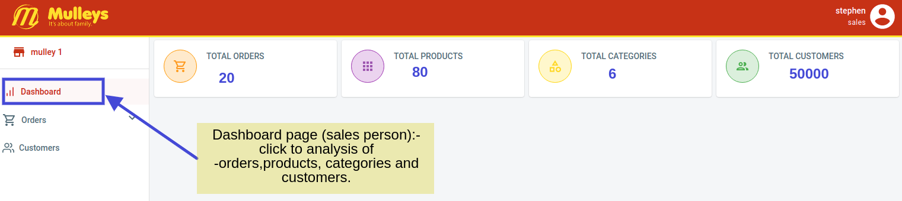
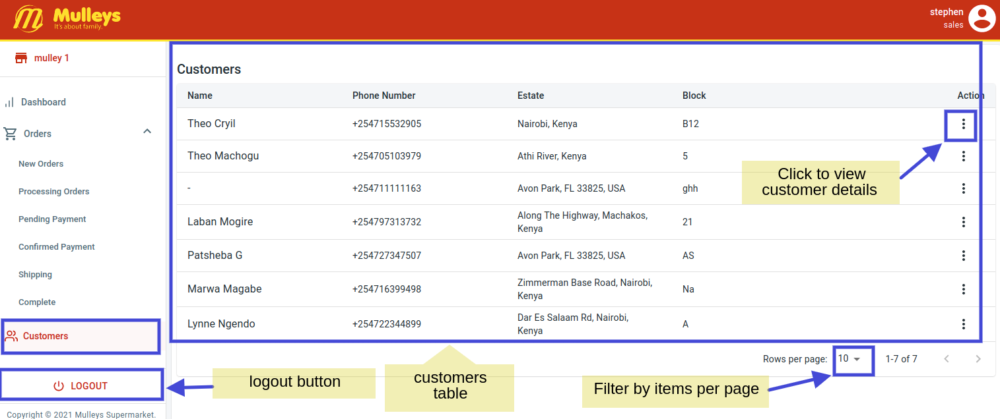

## [User Flow Doc for Mobitill - Mulleys Application](https://https://mulleys.mobitill.com//) [](https://twitter.com/intent/tweet?text=%F0%9F%9A%A8Devias%20Freebie%20Alert%20-%20An%20awesome%20ready-to-use%20register%20page%20made%20with%20%23material%20%23react%0D%0Ahttps%3A%2F%2Fdevias.io%20%23createreactapp%20%23devias%20%23material%20%23freebie%20%40devias-io)


## Mulleys Supermarket User Flow Documentation
> This is the User Flow Documentation for the Mulleys Supermarket Application.

_________________________________________________________
| Mulleys Application              | [https://mulleys.mobitill.com/](https://https://mulleys.mobitill.com//) |
| ------------------------ | ----------------------------------------------------------- |
| **DATE**                 | ✔ **17/03/2021** 
| - **VERSION**            | ✔ **1.0**  
| - **DESCRIPTION**        | ✔ **Mulleys Online supermarket .**     

________________________________________________________________________________________________________________________

`
# A. DASHBOARD APPLICATION
## 1.  Login Page

```
This is the Login Page to the Dashboard of the Mulleys Application.
- Enter Password and email to proceed.
- Click reset password for reseting your password.
```

[](https://https://mulleys.mobitill.com//)

> To reset password, you will be enabled to enter your email then you are sent a link to your email which you use to reset password.


## 2.  Order Details

```
- Click the Spread (...) syntax on the furthes right to view a Popover showing the finer details of that specific order
- You can click the 'Print Order' button
 to download that given order in PDF as shown below.
```

[](https://https://mulleys.mobitill.com//)


------------------------------
# i. Super Admin

## 1.  Manage Supermarkets

```
- Click the Supermarket tab to manage supermarkets


```

[](https://https://mulleys.mobitill.com//)


## 2.  Manage Product Categories

```
- Click to manage products categories


```

[](https://https://mulleys.mobitill.com//)


## 3.  Manage Product Categories

```
- More details to manage products


```

[](https://https://mulleys.mobitill.com//)


## 4.  Manage Customers

```
- Details to manage Customers


```

[](https://https://mulleys.mobitill.com//)


----------------------------------
# ii. Admin
---------------------------------

## 1.  Dashboard View
```
- Admin dashboard view for basic analytics of orders, products, categories and customers.


```

[](https://https://mulleys.mobitill.com//)


## 2.  Stock View
```
- Admin view for Stock.
- View the list of items in stock and click the "Add Stock" button to open the form for adding a stock item.

```

[](https://https://mulleys.mobitill.com//)


# iii. Sales Person

## 1.  Orders Status Page

```

Available Orders are displayed here.
- You will see availabe orders and their status like shown below.
- The table lists all orders and their status.


```
[](https://https://mulleys.mobitill.com//)

>Fulfilled orders are those which have gone through the whole process and are considered as complete.


## 2.  Dashboard View

```
Here is where you view Analysis of the Orders and Products and the Categories of Products you have, 
and also the number of Total customers.


```
[](https://https://mulleys.mobitill.com//)


## 3.  Order PDF View
```
- Order PDF View

```

[](https://https://mulleys.mobitill.com//)

## 4.  Customer Details Page

```
- This is the Page where you all your customers and their details.
- To have a better view of the Customer Details, click on the vertical spread syntax (...) to open clearer view and an option to print those details.


```

[](https://https://mulleys.mobitill.com//)


## 5.  User Profile

```
- Click the User Icon on the top right to view your profile. 
- This is a commom view for other dashboard users as well.


```

[](https://https://mulleys.mobitill.com//)


-----------------------------------------------------------
# B.  MOBILE APPLICATION - Customer


#### The Mulleys Mobile App is more straight foward and can be easily followed along without difficulty. For that reason pictures shown here will speak louder than words.

## 1.  Choose a supermarket


```
- Here is where you choose a supermarket of your choice form the list of supermarkets shown to you.


```

[](https://https://mulleys.mobitill.com//)

## 2.  View Products

```
- Then you can view products available in that chosen supermarket.
- You can add the Items to the card by clicking the the (+) Button.
- Your cart will update as items are added into the cart.

```

[](https://https://mulleys.mobitill.com//)

## 3.  View Cart

```
- View the number of items in the cart and
Increment or Decrement the number of cart items.


```

[](https://https://mulleys.mobitill.com//)


## 4.  Confirm Order

```
- Total amount shown to proceed to checkout.
- Number of cart items displayed in the cart.


```

[](https://https://mulleys.mobitill.com//)


## 5.  List of orders

```
- View list of orders and option to pay.


```

[](https://https://mulleys.mobitill.com//)


## 6.  Choose payment option

```
- Choose the payment option you prefer.


```

[](https://https://mulleys.mobitill.com//)


## 7.  Card payment screen

```
- Enter details for card payment


```

[](https://https://mulleys.mobitill.com//)


## 8.  Order details

```
- View order details including Total amount.


```

[](https://https://mulleys.mobitill.com//)


-------------------------------
# B.  MOBILE APPLICATION - Delivery
---------------------------


## 1.  Delivery Agent Login

```
- Login page for delivery agent


```

[](https://https://mulleys.mobitill.com//)


## 2.  Pending orders for delivery

```
-  Delivery agent can view list of pending orders for delivery.

```

[](https://https://mulleys.mobitill.com//)


## 3.  Order details## 3.  Orders Status Page

```

Available Orders are displayed here.
- You will see availabe orders and their status like shown below.
- The table lists all orders and their status.


```
[](https://https://mulleys.mobitill.com//)

>Fulfilled orders are those which have gone through the whole process and are considered as complete.


```
- Delivery agent can view order details for pending delivery.


```

[](https://https://mulleys.mobitill.com//)


## 4.  Confirm Order
```
- Enter code given by customer to confirm order


```

[](https://https://mulleys.mobitill.com//)
